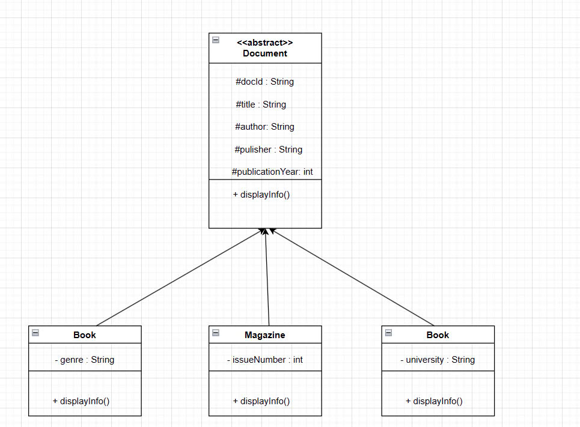

# Library Management Console Application

Ứng dụng quản lý thư viện đơn giản trên console, viết bằng Java.  
Hỗ trợ các chức năng cơ bản như: thêm, xóa, sửa, tìm kiếm tài liệu và quản lý người dùng.  
Đặc biệt tích hợp Google Books API để tìm kiếm và thêm sách từ kho sách trực tuyến.

## Tính năng

- Quản lý tài liệu: thêm, xóa, tìm kiếm, hiển thị danh sách.
- Quản lý người dùng.
- Quản lý mượn trả tài liệu.
- Tìm kiếm sách trên Google Books và thêm vào thư viện.
- 100% console, dễ sử dụng và mở rộng.

## Cấu trúc dự án

- `Model`: các lớp mô hình (Document, Book, User,...).
- `Service`: xử lý logic thư viện (Library).
- `Util`: các tiện ích, bao gồm Google Books API.
- `Main`: điểm bắt đầu chương trình.

## Sơ đồ kế thừa các class

## Hướng dẫn chạy

1. Clone project về máy.
2. Cài đặt Maven dependencies (bao gồm `org.json`).
3. Chạy class `Main.Main` để bắt đầu ứng dụng.
4. Theo menu, chọn chức năng và nhập dữ liệu theo hướng dẫn.

## Yêu cầu

- Java 8 trở lên
- Maven
- Kết nối internet để sử dụng Google Books API

---

Hãy sử dụng Branch API
